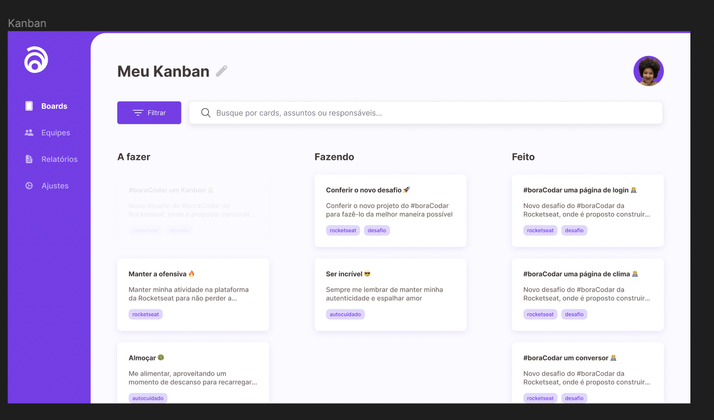

<h1 align="center"> #11 Login Page </h1>

Um Kanban é o #12 desafio <a href="https://boracodar.dev/">#BORACODAR</a> da RocketSeat 

  <a href="#-tecnologias">Tecnologias</a>&nbsp;&nbsp;&nbsp;|&nbsp;&nbsp;&nbsp;
  <a href="#-projeto">Projeto</a>&nbsp;&nbsp;&nbsp;|&nbsp;&nbsp;&nbsp;
  <a href="#-layout">Layout</a>&nbsp;&nbsp;&nbsp;|&nbsp;&nbsp;&nbsp;
  <a href="#-collaborators">Collaborators</a>&nbsp;&nbsp;&nbsp;|&nbsp;&nbsp;&nbsp;

 

  

## 🚀 Tecnologias

Esse projeto foi desenvolvido com as seguintes tecnologias:

- HTML
- CSS
- JavaScript
- React
- Git e Github
- Figma
- Chakra UI
- react-dnd
- Next

## 💻 Projeto

O projeto _Kanban_ foi realizado como parte do #12 desafio #BORACODAR da RocketSeat sugerido pelo professor <a href="https://github.com/maykbrito" alt="Link para o GitHub do professor Mayk Brito" target="_blank">Mayk Brito</a>.

<h1 align="center">
  Funcionalidades
</h1>

O desafio foi a criação de um kanban, além do layout proposto disponível em  <a href="#-layout-figma">Layout</a>, implementamos um Kanban funcional.

### Adicionar tasks

Clicando no botão + é possível adicionar tasks com até 3 tags

### Mover os cards

Usando o React-dnd e Chakra UI fizemos a funcionalidade de mover os cards para a coluna desejada

### Filtros

É possivel digitar a pesquisa desejada, e o retorno será referente ao conteúdo dentro do título e da descrição. Ao clicar no botão de filtro, vão aparecer tags usadas nas tasks que podem ser usadas como filtro também. Essas tags vão ser adicionadas dinamicamente conforme são criadas novas tasks com tags diferentes.

_<h2 align="center" ><a href="https://kanban-boracodar.vercel.app" target="_blank">Visite o projeto online</a></h2>_

## 🔖 Layout

Você pode visualizar o layout proposto pela RocketSeat através do da <a href="#-layout-figma">imagem abaixo</a>. Disponibilizado pelo [Figma](https://figma.com) durante o período do desafio.

  

## 📃 Collaborators

This challange was made by [Julia](https://gsajulia.github.io) and [Ricardo](https://rickazuo.github.io/portfolio/)
